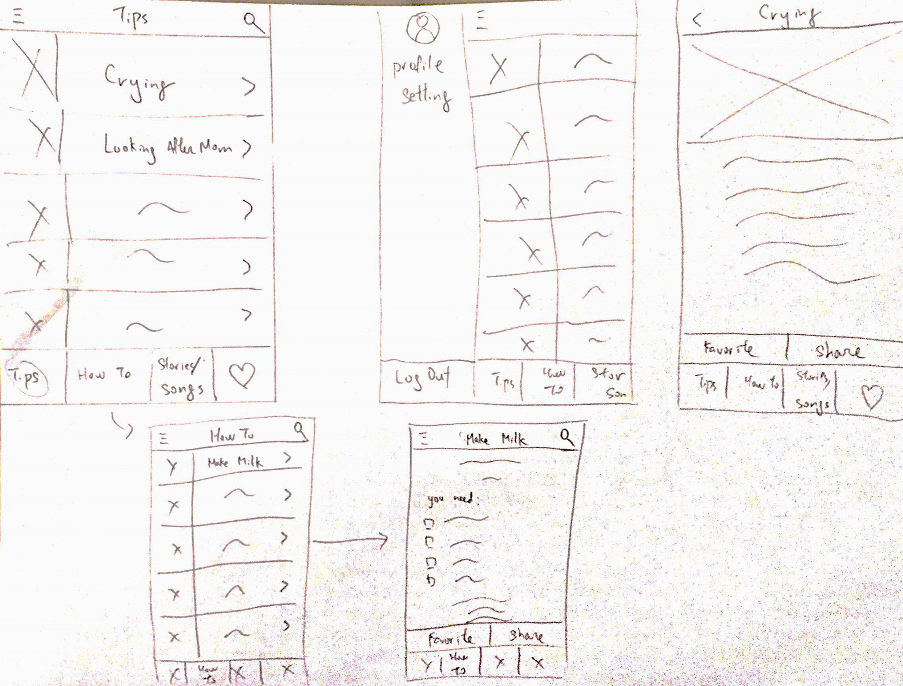

## Team Name: 
Daddy in the house!

## Members: 
1. Hao-In Choi
2. Connie Luong 
3. Boya Ren 
4. Alessandra Landingin

## Project Proposal:
Our app’s target population are dads-to-be and first time fathers who may be struggling to find ways to become more involved in the process of pregnancy and raising a  newborn child. Our app seeks to improve 3 aspects of this process: personal development in regards to fatherhood,  his relationship with his wife, and his relationship with his baby. Our team would like to address the existing gender roles that suggest confining a woman’s influence to the domestic space and a man’s influence to the public space. These gender stereotypes assume that women should take on the heavy-duty tasks of raising a child due to a female’s biological ability to nurture, which often leads to men not being fully integrated in the process of having and taking care of a new-born baby. Fortunately, it seems that more men want to play an active and informed role in fatherhood so that they may better support their partners and ultimately be a better father.  So our app aims to help families balance the commitment from both parents into this process and to provide new fathers with the appropriate resources to confidently kick out their first parenting experience!

The app idea fits within the project theme since none of our team members are first-time fathers or expect to be anytime soon. Our team proposes to use either a Google Barcode API as part of a functionality that allows fathers to determine if a product is safe for babies. We may also need to use web scraping to compile tips for fatherhood.  

### Alternative Ideas:
* Flower + Plant Identification App
    * Gardening and growing tips
    * Flower recognition with photos or based off of a series of questions
    * API: https://www.kaggle.com/alxmamaev/flowers-recognition
    * Our team does not know anything on plants. 
* Surfing App
    * This app would serve as a way for surfers to find new surfing destinations as well as to connect other surfers with one another.
        * Users would be able to search for surfing spots on a map and find information regarding surf forecast, as it is imperative for surfers to find suitable and safe conditions,  such as tide height, swell height, and temperature, on waves at specific times during the day since conditions change based on time.
        * Users would be able to “RSVP” to a time of day that they are going to be at a surf spot, as a way to let other surfers know approximately how many surfers will be at that destination at that time. 
        * There would be a section containing tutorial videos for maneuvers, “reading” a wave pattern, and to share photos of surfers out on the water, since a lot of surfers take their GoPros out with them/
        * API: https://developers.google.com/maps/documentation/javascript/tutorial
        * No one on our team surfs

## Storyboards
### Storyboard 1

### Storyboard 2

### Storyboard 3

## Prototypes
### Prototype 1 (Father App)

* Top row first image - home page showing the tips to first time dad, users can choose the one they want to read.
* Top row second image - when the users press the menu button, the hidden user setting space will show
* Top row third image - this is the blog section when the users press the tip. Users can share or make it as favorite. 
* Bottom row first image - this is the "How to" Page, similar interaction as the "Tips page"
* Bottom row second image - this is the blog section when the users press the tip. Users can share or make it as favorite. Similar to the one in the "Tips" page

### Prototype 2 (Father App)

* Top row first image - home page showing slider of important blog posts and quick links
* Top row second image - trending newsfeed
* Navigation - includes quick links to the 'search', 'favorites,' 'scan,' and 'settings' pages.
* Labels at the very top - provide quick access/filters for trending, mom, baby, and father posts/content
* Bottom row 2 image - a simple blog post format
* Bottom row 3 image - search page, with recent searches as well as trending searches. Also a button to scan product

### Prototype 3 (Surfing App)

1. Map of surf spots
2. Calendar of when surf spots are RSVP’d to
3. Tutorial section/photo sharing 

1. Click on a surf location from the map and it takes you to the destination’s information page that  contains surf conditions
2. When you click on a day, you can search for a location and see who has RSVP’d to that location at that time
3. Newsfeed of photos 

