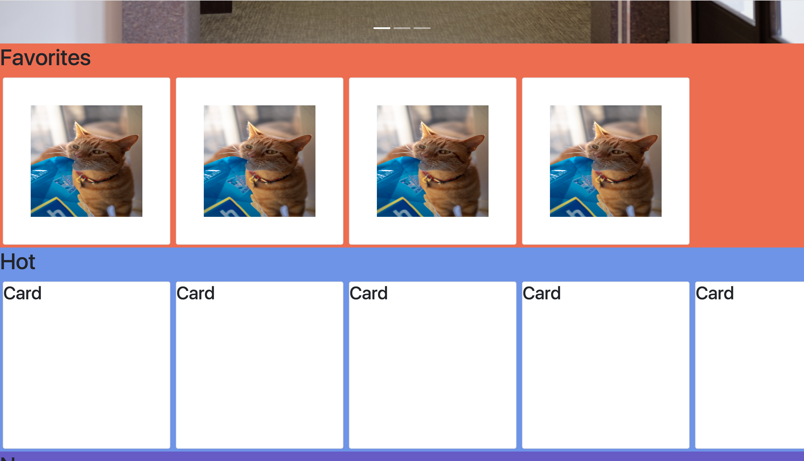
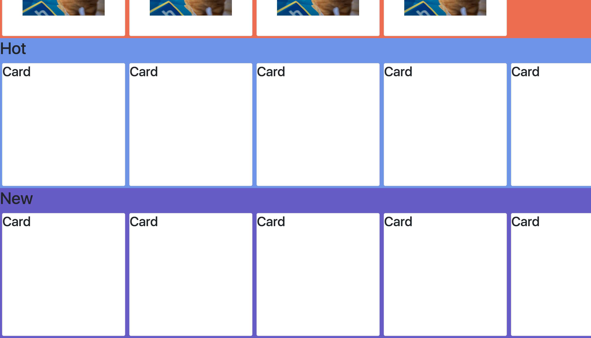
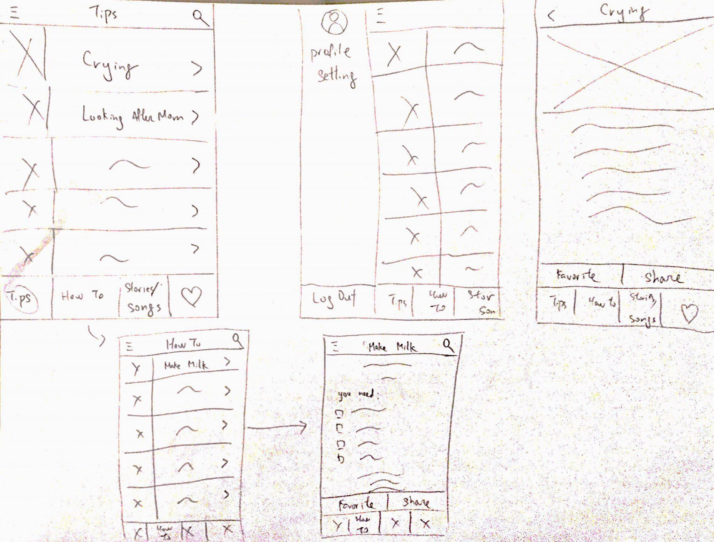

## Team Name: 
Daddy in the house!

## Members: 
1. Hao-In Choi
2. Connie Luong 
3. Boya Ren 
4. Alessandra Landingin

## Idea update: 
In milestone 1, we mentioned the idea of having some sort of app targeting first time fathers. We have decided to charge on with this idea. However, we did realize that the original idea was a bit lacking in terms of functionality. Originally, we proposed to have more of an information based app. But this alone didn't make the app very useful or interactive at all. So we decided to add a 'Songs & Stories' functionality. This would provide users access to a library of songs and stories they can share with their child. These songs and stories can also be saved into the user's Favorites for easy access. 

## Screenshots of UI skeleton webpages

The main navigation page

The Story page(1st screenshot)

The Story page(2nd screenshot)

The Story page(3rd screenshot)

### Comparison to paper protoypes

After recieving feedback from the TA and changed the major functions of the app as we stated above, we decided to adapt most of the layout from prototype 1 in milestone 1. 

We adapted the card formats in the main screen and the 'Songs & Stories' screen but we thought that it would be better if we changed them into retangular cards. Such UI design has serveral adventages over the one in the prototype 1. 

1. The cover picture consists a larger portion of the card.
2. It gives spaces for the favorite and share buttons
3. It looks less crowded.

The other change we made in the new version is that we took the bottom navbar away since it doesn't work well when we are making a webapp. Instead, we put all the navigation options into the side navbar.

The last change we made is the new 'Songs & Stories' page. It is completely new. It has a carousel on the top which will display the top songs/stories. Then there are three sections which the users can scroll them horizontally. Each section contains the songs/stories in the categories of either favorites, hot, and new. 

