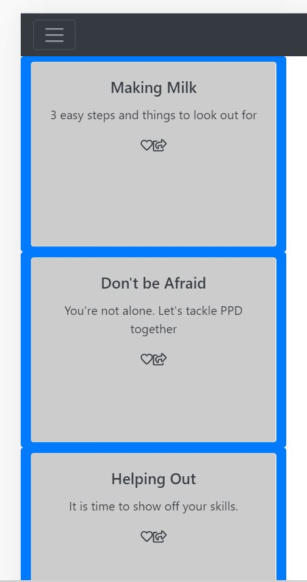
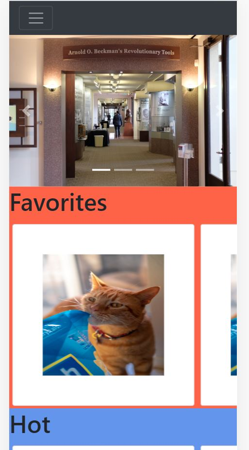
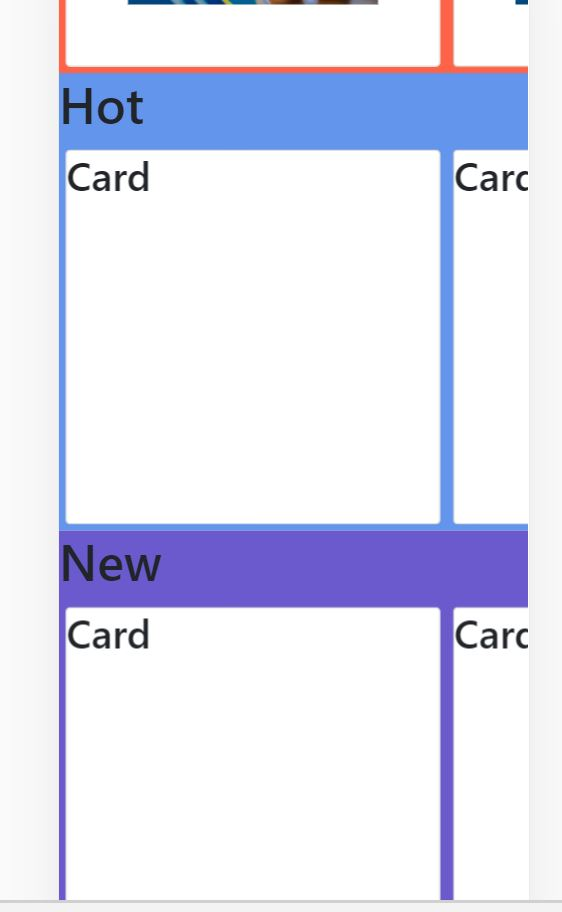
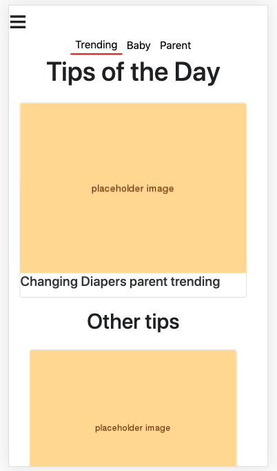
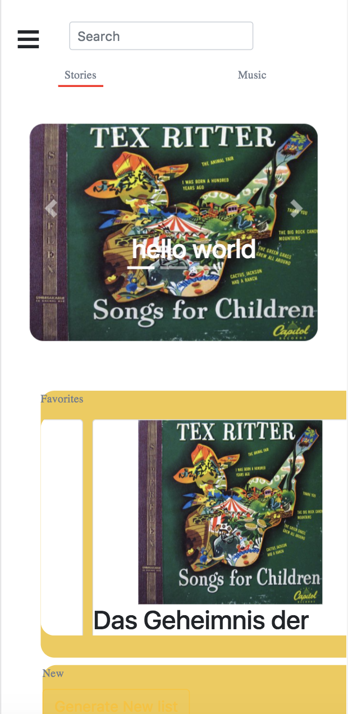
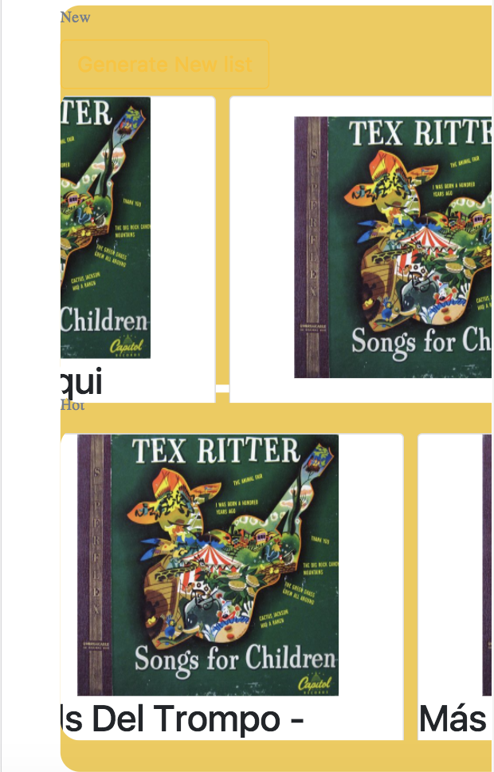

## Team Name: 
Daddy in the house!

## Members: 
1. Hao-In Choi
2. Connie Luong 
3. Boya Ren 
4. Alessandra Landingin

## Screenshots of UI skeleton webpages

### The old UI 

The home screen (feed page)
It contains the tips which will be presented in the form of news feed. User can navigate to other pages via the menu button at the top left corner. 

The Songs & Stories page which the carousel will feature the hottest stories and songs. And there are three sections which will suggest the stories and songs for the users.

### The redesigned UI

In the redesigned UI of the home page/feed screen, which essentially is a list of "tip cards," we reformatted the style of the card such that the image representing the tip will be stacked ontop of the tip's title. We also added category headings ("Trending," "Baby," "Parent") to act as a way of filtering the content into those different categories. A user can filter through the tip feed by tapping on the different categories. 
Also, rather than displaying the favorite and share button on the tip card itself, the user will have to click on the tip itself and the buttons and the content of the tip will appear as a "drop down," still on the same page by loading from the firebase instead of going to a new page.

On the redesigned bedtime page, we added a search bar on the top which allows users to search for any story or music that they like. We also added category headings ("Stories""Music") to offer users a way to switch between these two sections easily. Besides, we made some minor stylings, such as use round corner for the carousel to create a sense of comfort.
