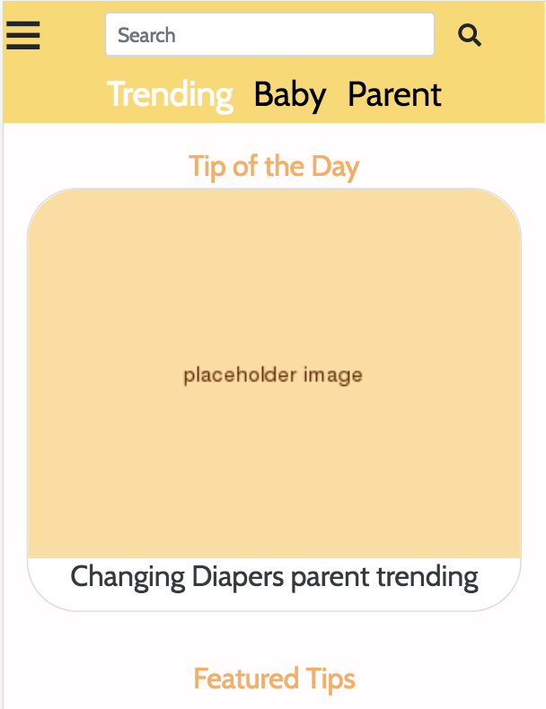
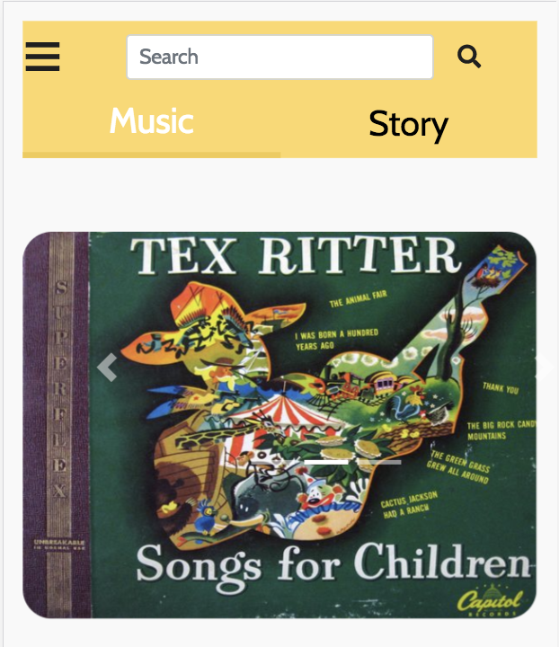
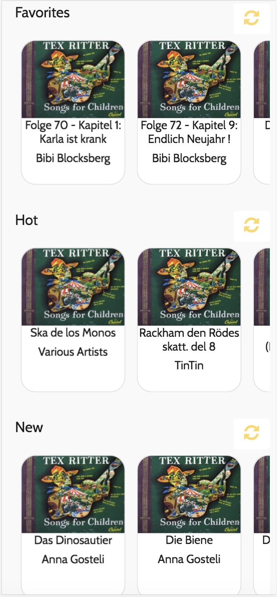
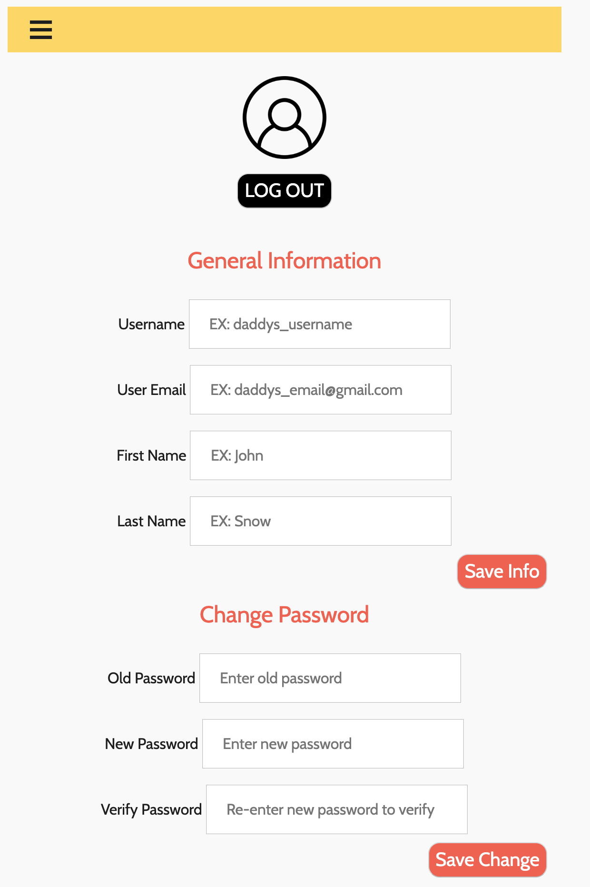

## Team Name: 
Daddy in the house!

## Members: 
1. Hao-In Choi
2. Connie Luong 
3. Boya Ren 
4. Alessandra Landingin

### Latest UI webpages

### The Re-Designed UI
We created a style guide for typography and color scheme. We made the header on the top with our theme color, an honey yellow, for every page to make the design consistent and we made the selected button white to make it stand out. We styled all fonts to make the texts more readible and visually appealing. We created the search bar on the top for the two main pages for users to quickly look for the information that they want. 
We made the "regenerate" button on the right side of each row for "favorites" "hot" and "New" and so users can regenerate a list for each category if they don't like the content listed there.
We made the user information page and thus each user can have a profile and in this way they are able to save their favorite stories and music into their account.

### User Action 1 - Browsing and filtering feed
When opening the webapp, you are greeted with a feed of "tips". The tips vary by content, so to make browsing easier, users can utilize the filter action to more conveniently browse tips. After pressing the filter, the javascript code will filter out the desire contents for the users based on the tags within the data objects. The filters can be easily found at the top of the feed. Because the main purpose of the app is to help educate new fathers, we found it important to put the tips first and foremost. But to prevent users from being too overwhelmed with the number of tips, they can utilize the filter options to better browse and discover through the information on the feed. 

### User Action 2 - Favorites
Our second main user action allows users to favorite the tips, songs, or stories that they want to save. This is an important functionality for our webapp because it allows user's to be able to have quick access and the ability to go back to a tip, for example, that they found super important or helpful to them.  All these favorited items will be saved in their favorites tab. Thus, in order to utilize this function, a user will need to be signed in, browsing over the tips and press the favorite button. The content will automatically save in the favorite page and will be sorted in its respective category.
