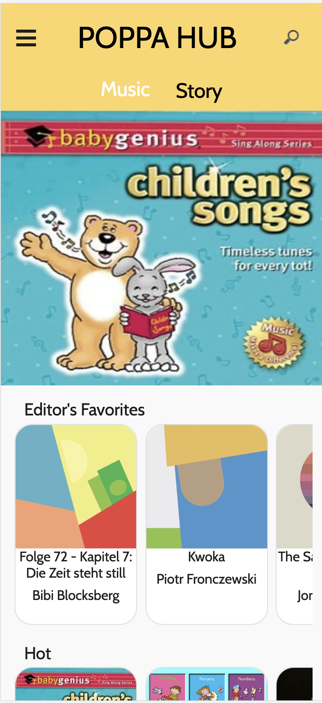
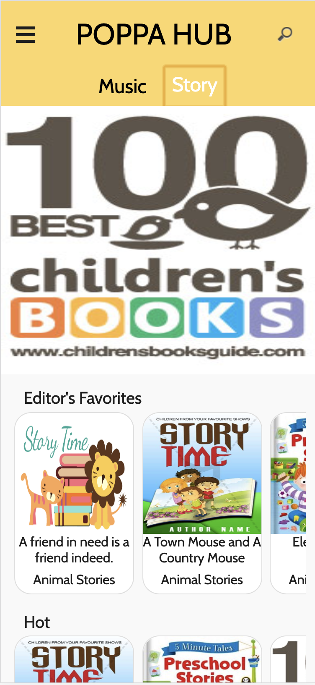
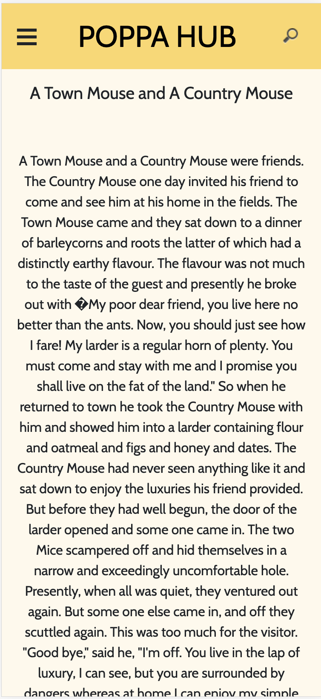
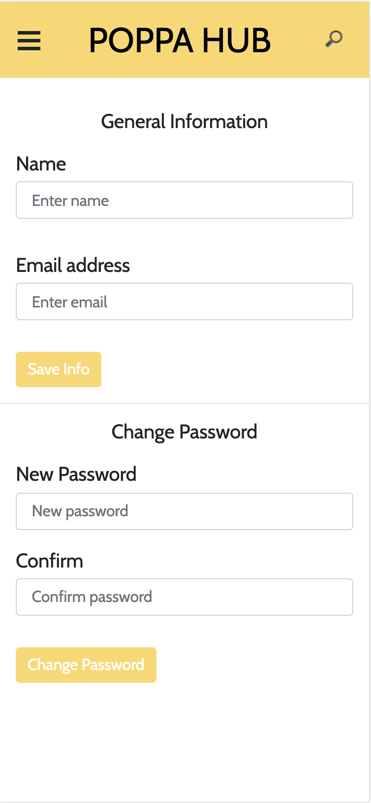
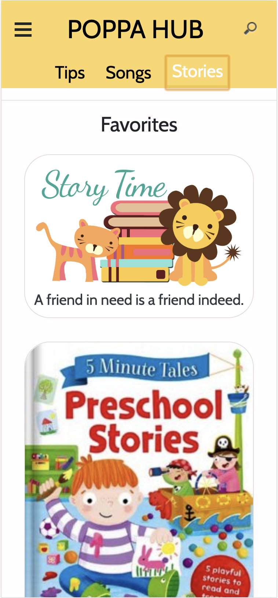
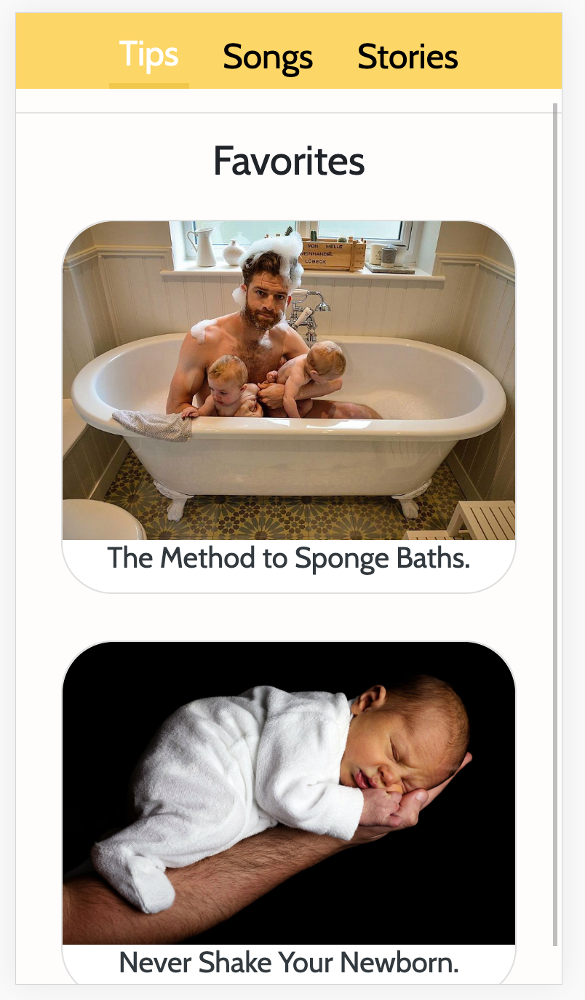
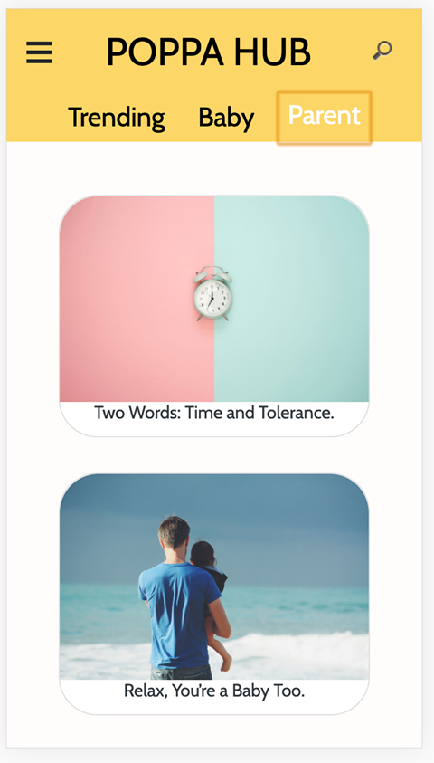
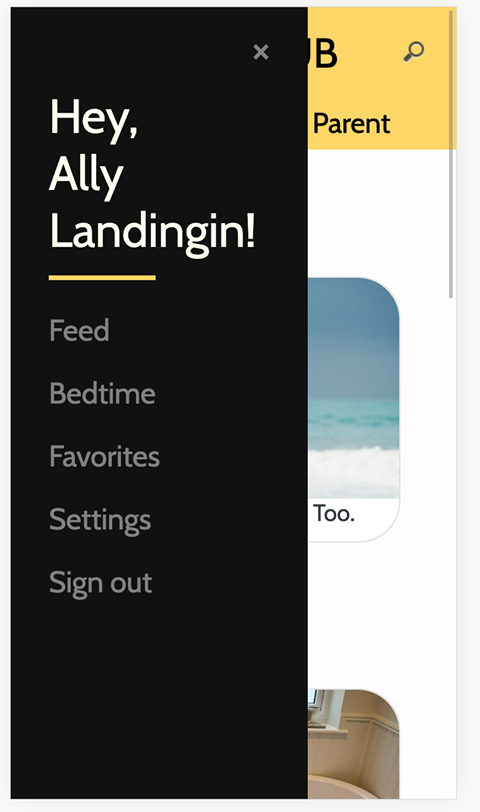

## Team Name: 
Daddy in the house!

## Members: 
1. Hao-In Choi
2. Connie Luong 
3. Boya Ren 
4. Alessandra Landingin

### User story

Our app, Popper Hub’s target population are dads-to-be and first time fathers who may be struggling to find ways to become more involved in the process of pregnancy and raising a newborn child. Our app seeks to improve 3 aspects of this process: personal development in regards to fatherhood, his relationship with his wife, and his relationship with his baby. Since our app is essentially a collection of resources for fathers, we imagine that it would be used in such a way that when a dad has questions in regards to a particular situation that he is in involving the infant or his wife, he would open Daddy's House to gain access to reliable and comprehensive information on fatherhood. For example, if a father current methods for calming down a crying infant are unsuccessful, he could search through the tips section on our app to find a "tip article" on ways to soothe a fussy baby. Our app would then provide suggestions for the father. He would also be able to favorite the tip and it would be stored on his profile for more immediate access the next time around. Also, our app contains collections of songs and stories for when a dad might want to play music or read a story to his infant. For example, if a father is waiting outside for his wife to finish grocery shopping and the infant gets fussy, he could open up the app and find a children's story that he could read to the baby as a way to pass time and keep the baby calm. 

### UI screenshots
screenshots of your latest UI webpages embedded directly within the file.

### UI improvement

We updated all the pictures in the app to tailor the whole theme of the app (caring and informative). The cards are made more rounder which give a more modern feeling to the users. We added the app's name "Popper Hub" on the top navbar which orginally is the search bar, but now we hide the search bar into an icon. Whenever user presses it, it will show up dynamically. In the bedtime page, we changed the regenearate button to an icon which will make it more visually pleasing. In the navbar menu, we added a greeting to the user. It will show the user's name if they are logged in. If not, it will show "hi there".

### How data is displayed

Data is displayed in several ways in our app: on "tip cards" on a "tip feed" that has relevant filters, on story pages, and music pages. 

milestone5.md contains screenshots of how your data is displayed or visualized within your app. 
Include these as separate screenshots in addition to the general UI screenshots in rubric item 2. 
(You don't need a fancy visualization, but your data needs to be shown in a way that makes sense for your app.)

### Data display or visualizations

For the tips, we imported the data into our firebase and pulled the relevant data from there to display on the sceen for the user. To help with the parsing the data from the database, we use functions from the Underscorejs library. We also used the musixmatch API to get access to the popular children songs and their lyrics. Using the data from their API, we adjusted it to fit into the templates to display on the screen for the user. For stories, we scraped the web for children stories and imported that data into our firebase. Like the tips, we pulled the data from the database and parsed it so that we could display it on the screen as well.

Most all data interactions are done either with the musixmatch API or with firebase.

### Ambitious data display or visualization ideas

When brainstorming for our app, one of the more ambitious data display ideas involved the relationship between a dad and his wife by giving advice tailored to supporting his wife in situations that he may have no idea how to handle during and after pregnancy. We invisioned that the app would ask a series of questions in regards to his wife's mood, behaviors, cravings, etc. to get a more personalized information on how to navigate his relationship with his wife. For example:
Question: "How has your partner described her self confidence as of recent?" Answer: "Minimal, self-depricating"
Question: "When was the last time you had date nigt with your partner"  Answer: "2 weeks ago"
Question: "Does your partner want to go out on date night?" Answer: "Indifferent"

Based on these three questions, the app would suggest ways in which the father could help increase his wife's self-confidence. Perhaps it would encourage the husband to compliment his wife, to make dinner for her, etc. Depending on how the questions are answered by the dad, the app would generate relevant information that could help out.
